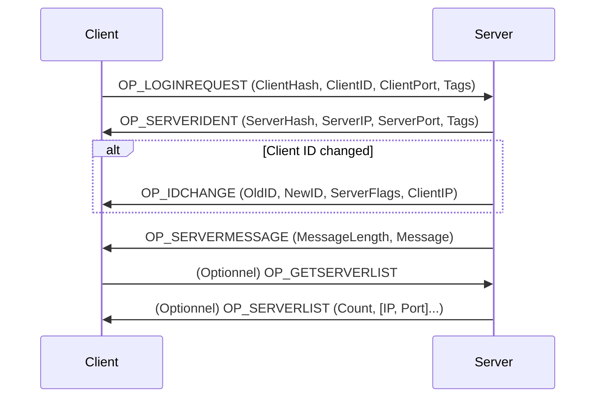
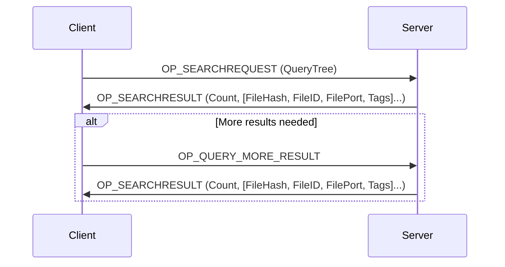
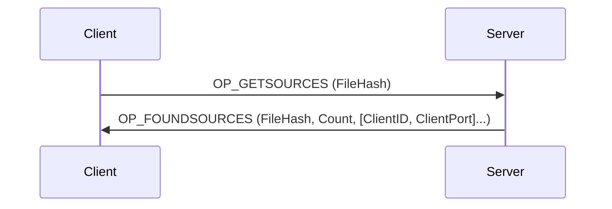
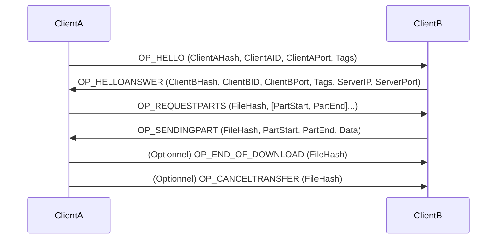
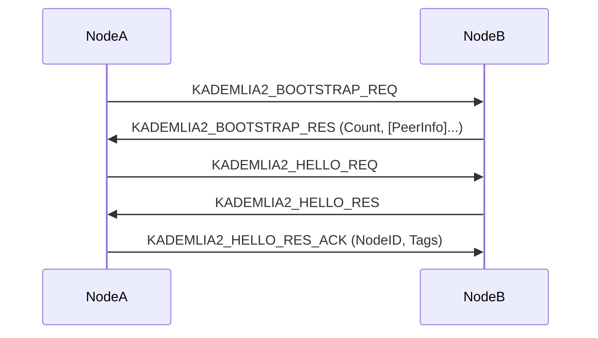
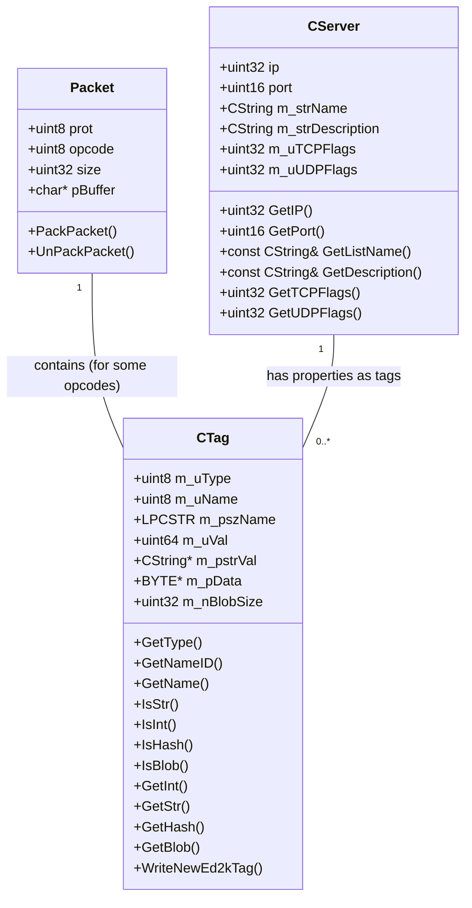

arkdown# eMule Protocol Retro-Specification

The eMule protocol is a binary protocol that uses specific headers to encapsulate data and "tags" to carry metadata. It includes TCP and UDP communications, as well as a decentralized Kademlia sub-protocol.

---

## 1. General Packet Structure

All packets start with a header that identifies the protocol and the opcode.

### a. TCP Header (Header_Struct)

* **`eDonkeyID`** (uint8): Protocol identifier.
    * `EMULE_PROTOCOL` (0x01): Base eMule protocol.
    * `OP_EDONKEYPROT` (0xE3): eDonkey protocol (used by eMule).
    * `OP_EMULEPROT` (0xC5): Extended eMule protocol.
    * `OP_KADEMLIAHEADER` (0xE4): Kademlia header.
    * `OP_PACKEDPROT` (0xD4): Indicates the packet is compressed (zlib). The original protocol is `OP_EMULEPROT`.
    * `OP_KADEMLIAPACKEDPROT` (0xE5): Indicates the Kademlia packet is compressed. The original protocol is `OP_KADEMLIAHEADER`.

* **`packetlength`** (uint32): Total length of the packet in bytes, **including the opcode** but **excluding** `eDonkeyID` and `packetlength` itself.

* **`command`** (uint8): Specific opcode for the action or message.

### b. UDP Header (UDP_Header_Struct)

* **`eDonkeyID`** (uint8): Protocol identifier (usually `EMULE_PROTOCOL` 0x01).
* **`command`** (uint8): Specific opcode for the action or message.

### c. Compression

Packets can be compressed using zlib. If `eDonkeyID` is `OP_PACKEDPROT` or `OP_KADEMLIAPACKEDPROT`, the rest of the packet is compressed. The client/server must decompress the packet before processing it.

---

## 2. Opcodes

Opcodes define the type of message exchanged. They are grouped by communication context.

### a. Client <-> Server Opcodes (TCP)

These opcodes handle connection, search, source management, and server information.

* **`OP_LOGINREQUEST` (0x01)**: Client connects to the server.
    * Content: `ClientHash` (16 bytes), `ClientID` (4 bytes), `ClientPort` (2 bytes), `Tags` (set of tags describing the client).

* **`OP_REJECT` (0x05)**: Server rejects a request or connection.

* **`OP_GETSERVERLIST` (0x14)**: Client requests the list of known servers.

* **`OP_OFFERFILES` (0x15)**: Client informs the server of the files it is sharing.
    * Content: `Count` (4 bytes), followed by `Count` sets of (`FileHash` (16 bytes), `FileID` (4 bytes), `FilePort` (2 bytes), `Tags`).

* **`OP_SEARCHREQUEST` (0x16)**: Client sends a search request.
    * Content: `Query_Tree` (tag structure describing the search).

* **`OP_DISCONNECT` (0x18)**: Client disconnects from the server.

* **`OP_GETSOURCES` (0x19)**: Client requests sources for a given `FileHash`.
    * Content: `FileHash` (16 bytes).

* **`OP_QUERY_MORE_RESULT` (0x21)**: Client requests more results for a previous search.

* **`OP_SERVERLIST` (0x32)**: Server sends a list of servers to the client.
    * Content: `Count` (1 byte), followed by `Count` sets of (`IP` (4 bytes), `Port` (2 bytes)).

* **`OP_SEARCHRESULT` (0x33)**: Server sends search results.
    * Content: `Count` (4 bytes), followed by `Count` sets of (`FileHash` (16 bytes), `FileID` (4 bytes), `FilePort` (2 bytes), `Tags`).

* **`OP_SERVERSTATUS` (0x34)**: Server sends its status (number of users, files).
    * Content: `Users` (4 bytes), `Files` (4 bytes).

* **`OP_SERVERMESSAGE` (0x38)**: Server sends a text message to the client.
    * Content: `Length` (2 bytes), `Message` (string of `Length` bytes).

* **`OP_IDCHANGE` (0x40)**: Server informs the client of an ID change.
    * Content: `NewID` (4 bytes), `ServerFlags` (4 bytes), `PrimaryTCPPort` (4 bytes, unused), `ClientIPAddress` (4 bytes).

* **`OP_SERVERIDENT` (0x41)**: Server identifies itself to the client.
    * Content: `ServerHash` (16 bytes), `IP` (4 bytes), `Port` (2 bytes), `Tags`.

* **`OP_FOUNDSOURCES` (0x42)**: Server sends found sources for a file.
    * Content: `FileHash` (16 bytes), `Count` (1 byte), followed by `Count` sets of (`ClientID` (4 bytes), `ClientPort` (2 bytes)).

* **`OP_GETSOURCES_OBFU` (0x23) / `OP_FOUNDSOURCES_OBFU` (0x44)**: Obfuscated versions of source request/response.

### b. Client <-> Server Opcodes (UDP)

* Global search requests: `OP_GLOBSEARCHREQ` (0x98), `OP_GLOBSEARCHREQ2` (0x92), `OP_GLOBSEARCHREQ3` (0x90)
* Server status: `OP_GLOBSERVSTATREQ` (0x96) / `OP_GLOBSERVSTATRES` (0x97)
* Global sources: `OP_GLOBGETSOURCES` (0x9A), `OP_GLOBGETSOURCES2` (0x94), `OP_GLOBFOUNDSOURCES` (0x9B)
* Server list: `OP_SERVER_LIST_REQ` (0xA0), `OP_SERVER_LIST_REQ2` (0xA4), `OP_SERVER_LIST_RES` (0xA1)
* Server description: `OP_SERVER_DESC_REQ` (0xA2) / `OP_SERVER_DESC_RES` (0xA3)

### c. Client <-> Client Opcodes (TCP)

* **`OP_HELLO` (0x01)**: Initial handshake between two clients.
* **`OP_SENDINGPART` (0x46)**: Sending a file part.
* **`OP_REQUESTPARTS` (0x47)**: Request for file parts.
* **`OP_FILEREQANSNOFIL` (0x48)**: File not available.
* **`OP_END_OF_DOWNLOAD` (0x49)**: End of download notification.
* **`OP_ASKSHAREDFILES`** / **`OP_ASKSHAREDFILESANSWER`** (0x4A/0x4B): Shared files list.
* **`OP_HELLOANSWER` (0x4C)**: Hello response.
* **`OP_MESSAGE` (0x4E)**: Text message between clients.
* **`OP_STARTUPLOADREQ`** (0x54), **`OP_ACCEPTUPLOADREQ`** (0x55), **`OP_CANCELTRANSFER`** (0x56)
* **`OP_REQUESTFILENAME`** / **`OP_REQFILENAMEANSWER`** (0x58/0x59)
* **`OP_QUEUERANK` (0x5C)**
* 64-bit versions: **`OP_SENDINGPART_I64`** (0xA2) / **`OP_REQUESTPARTS_I64`** (0xA3)

### d. Client <-> Client Opcodes (Extended UDP)

* `OP_REASKFILEPING` (0x90), `OP_FILENOTFOUND` (0x92), `OP_QUEUEFULL` (0x93), `OP_DIRECTCALLBACKREQ` (0x95), `OP_PORTTEST` (0xFE)

### e. Kademlia Opcodes (UDP)

* Bootstrap: `KADEMLIA2_BOOTSTRAP_REQ` (0x01) / `KADEMLIA2_BOOTSTRAP_RES` (0x09)
* Hello: `KADEMLIA2_HELLO_REQ` (0x11) / `KADEMLIA2_HELLO_RES` (0x19) / `KADEMLIA2_HELLO_RES_ACK` (0x22)
* General: `KADEMLIA2_REQ` (0x21) / `KADEMLIA2_RES` (0x29)
* Search: `KADEMLIA_SEARCH_REQ`, `KADEMLIA2_SEARCH_KEY_REQ`, etc.
* Publish: `KADEMLIA_PUBLISH_REQ`, `KADEMLIA2_PUBLISH_KEY_REQ`, etc.
* Firewall: `KADEMLIA_FIREWALLED_REQ`, etc.
* Keep-alive: `KADEMLIA2_PING` (0x60) / `KADEMLIA2_PONG` (0x61)

---

## 3. Tags

Tags are flexible key-value pairs used to transmit metadata.

### a. Tag Structure

A tag consists of:

* **`Type`** (uint8): Data type.
    * `TAGTYPE_HASH` (0x01), `TAGTYPE_STRING` (0x02), `TAGTYPE_UINT32` (0x03), etc.

* **`Name` or `ID`**:
    * If the high bit of `Type` is set (`Type | 0x80`), the name is a numeric `ID` (uint8).
    * Otherwise, the name is a string: `Length` (uint16) + `Name`.

### b. Common Tag Names/IDs

* **Server tags** (`ST_...`): `ST_SERVERNAME`, `ST_DESCRIPTION`, `ST_VERSION`, etc.
* **File tags** (`FT_...`): `FT_FILENAME`, `FT_FILESIZE`, `FT_FILETYPE`, `FT_MEDIA_ARTIST`, etc.
* **Client tags** (`CT_...`): `CT_NAME`, `CT_VERSION`, `CT_EMULE_MISCOPTIONS1`, etc.

---

## 4. Flags and Versions

* **Server TCP Flags** (`SRV_TCPFLG_...`)
* **Server UDP Flags** (`SRV_UDPFLG_...`)
* **Kademlia Versions**
* **Server Capabilities** (`SRVCAP_...`)

## 5. Diagrammes UML

### a. Diagramme de Séquence : Connexion Client-Serveur

### b. Diagramme de Séquence : Recherche de Fichiers (Client-Serveur)

### c. Diagramme de Séquence : Demande et Obtention de Sources (Client-Serveur)

### d. Diagramme de Séquence : Transfert de Fichier (Client-Client)

### e. Diagramme de Séquence : Kademlia - Bootstrap et Hello

### f. Diagramme de Classes (Simplifié) : Entités Principales

