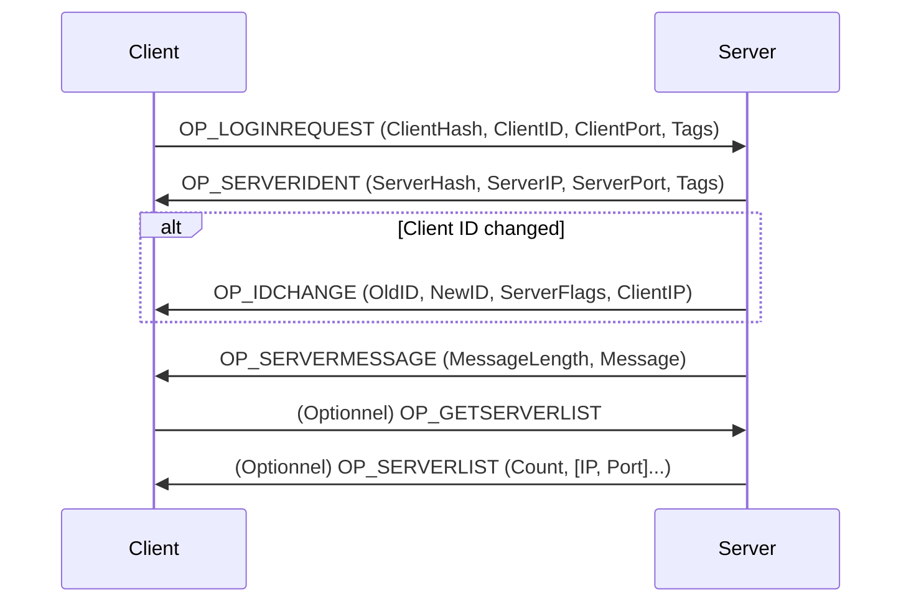
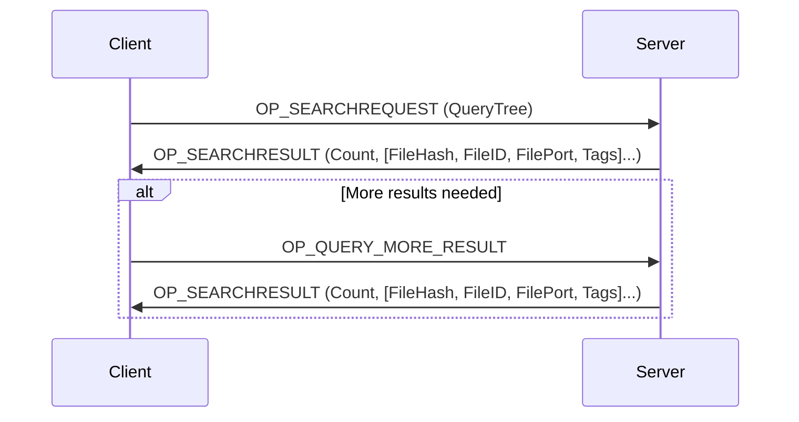
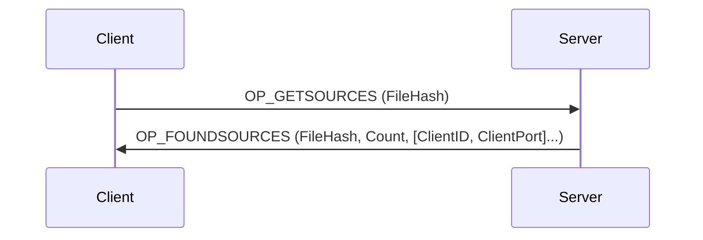
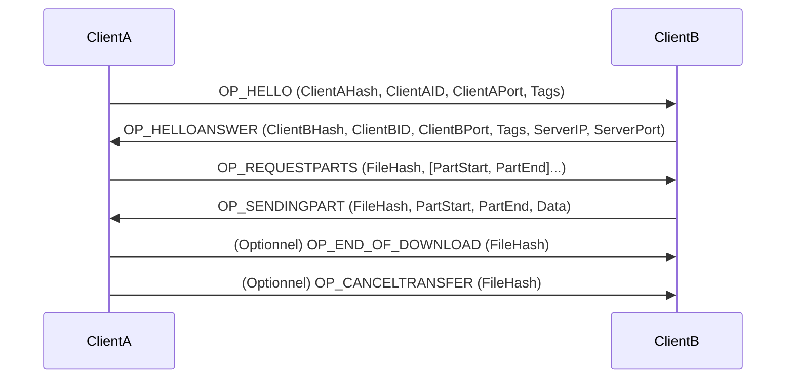
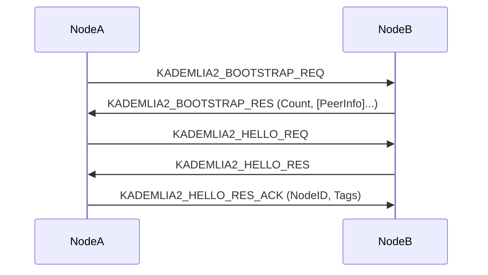
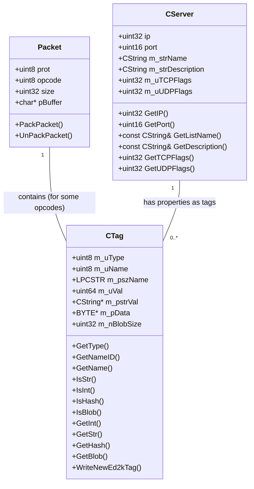

# Rétro-spécification du Protocole eMule

Le protocole eMule est un protocole binaire qui utilise des en-têtes spécifiques pour encapsuler les données et des "tags" pour véhiculer les métadonnées. Il existe des communications TCP et UDP, ainsi qu'un sous-protocole Kademlia décentralisé.

---

## 1. Structure Générale des Paquets

Tous les paquets commencent par un en-tête qui identifie le protocole et l'opcode.

### a. En-tête TCP (Header_Struct)

*   **`eDonkeyID`** (uint8) : Identifiant du protocole.
    *   `EMULE_PROTOCOL` (0x01) : Protocole eMule de base.
    *   `OP_EDONKEYPROT` (0xE3) : Protocole eDonkey (utilisé par eMule).
    *   `OP_EMULEPROT` (0xC5) : Protocole eMule étendu.
    *   `OP_KADEMLIAHEADER` (0xE4) : En-tête Kademlia.
    *   `OP_PACKEDPROT` (0xD4) : Indique que le paquet est compressé (zlib). Le protocole original est `OP_EMULEPROT`.
    *   `OP_KADEMLIAPACKEDPROT` (0xE5) : Indique que le paquet Kademlia est compressé. Le protocole original est `OP_KADEMLIAHEADER`.
*   **`packetlength`** (uint32) : Longueur totale du paquet en octets, incluant l'opcode mais pas `eDonkeyID` ni `packetlength` lui-même.
*   **`command`** (uint8) : L'opcode spécifique de l'action ou du message.

### b. En-tête UDP (UDP_Header_Struct)

*   **`eDonkeyID`** (uint8) : Identifiant du protocole (souvent `EMULE_PROTOCOL` 0x01).
*   **`command`** (uint8) : L'opcode spécifique de l'action ou du message.

### c. Compression

Les paquets peuvent être compressés en utilisant zlib. Si `eDonkeyID` est `OP_PACKEDPROT` ou `OP_KADEMLIAPACKEDPROT`, le reste du paquet est compressé. Le client/serveur doit décompresser le paquet avant de le traiter.

---

## 2. Opcodes

Les opcodes définissent le type de message échangé. Ils sont regroupés par contexte de communication.

### a. Opcodes Client <-> Serveur (TCP)

Ces opcodes gèrent la connexion, la recherche, la gestion des sources et les informations du serveur.

*   **`OP_LOGINREQUEST` (0x01)** : Le client se connecte au serveur.
    *   Contenu : `ClientHash` (16 octets), `ClientID` (4 octets), `ClientPort` (2 octets), `Tags` (ensemble de tags décrivant le client).
*   **`OP_REJECT` (0x05)** : Le serveur rejette une requête ou une connexion.
*   **`OP_GETSERVERLIST` (0x14)** : Le client demande la liste des serveurs connus.
*   **`OP_OFFERFILES` (0x15)** : Le client informe le serveur des fichiers qu'il partage.
    *   Contenu : `Count` (4 octets), suivi de `Count` ensembles de (`FileHash` (16 octets), `FileID` (4 octets), `FilePort` (2 octets), `Tags`).
*   **`OP_SEARCHREQUEST` (0x16)** : Le client envoie une requête de recherche.
    *   Contenu : `Query_Tree` (structure de tags décrivant la recherche).
*   **`OP_DISCONNECT` (0x18)** : Le client se déconnecte du serveur.
*   **`OP_GETSOURCES` (0x19)** : Le client demande des sources pour un `FileHash` donné.
    *   Contenu : `FileHash` (16 octets).
*   **`OP_QUERY_MORE_RESULT` (0x21)** : Le client demande plus de résultats pour une recherche précédente.
*   **`OP_SERVERLIST` (0x32)** : Le serveur envoie une liste de serveurs au client.
    *   Contenu : `Count` (1 octet), suivi de `Count` ensembles de (`IP` (4 octets), `Port` (2 octets)).
*   **`OP_SEARCHRESULT` (0x33)** : Le serveur envoie les résultats d'une recherche.
    *   Contenu : `Count` (4 octets), suivi de `Count` ensembles de (`FileHash` (16 octets), `FileID` (4 octets), `FilePort` (2 octets), `Tags`).
*   **`OP_SERVERSTATUS` (0x34)** : Le serveur envoie son statut (nombre d'utilisateurs, de fichiers).
    *   Contenu : `Users` (4 octets), `Files` (4 octets).
*   **`OP_SERVERMESSAGE` (0x38)** : Le serveur envoie un message texte au client.
    *   Contenu : `Length` (2 octets), `Message` (chaîne de caractères de `Length` octets).
*   **`OP_IDCHANGE` (0x40)** : Le serveur informe le client d'un changement de son ID.
    *   Contenu : `NewID` (4 octets), `ServerFlags` (4 octets), `PrimaryTCPPort` (4 octets, inutilisé), `ClientIPAddress` (4 octets).
*   **`OP_SERVERIDENT` (0x41)** : Le serveur s'identifie au client.
    *   Contenu : `ServerHash` (16 octets), `IP` (4 octets), `Port` (2 octets), `Tags` (ensemble de tags décrivant le serveur).
*   **`OP_FOUNDSOURCES` (0x42)** : Le serveur envoie les sources trouvées pour un fichier.
    *   Contenu : `FileHash` (16 octets), `Count` (1 octet), suivi de `Count` ensembles de (`ClientID` (4 octets), `ClientPort` (2 octets)).
*   **`OP_GETSOURCES_OBFU` (0x23) / `OP_FOUNDSOURCES_OBFU` (0x44)** : Versions obfusquées des requêtes/réponses de sources.

### b. Opcodes Client <-> Serveur (UDP)

Ces opcodes sont principalement utilisés pour des requêtes rapides et des informations de statut.

*   **`OP_GLOBSEARCHREQ` (0x98), `OP_GLOBSEARCHREQ2` (0x92), `OP_GLOBSEARCHREQ3` (0x90)** : Requêtes de recherche globale.
*   **`OP_GLOBSERVSTATREQ` (0x96)** : Requête de statut du serveur.
*   **`OP_GLOBSERVSTATRES` (0x97)** : Réponse de statut du serveur.
    *   Contenu : `Users` (4 octets), `Files` (4 octets).
*   **`OP_GLOBGETSOURCES` (0x9A), `OP_GLOBGETSOURCES2` (0x94)** : Requêtes de sources globales.
*   **`OP_GLOBFOUNDSOURCES` (0x9B)** : Réponse de sources globales trouvées.
*   **`OP_SERVER_LIST_REQ` (0xA0), `OP_SERVER_LIST_REQ2` (0xA4)** : Requêtes de liste de serveurs.
*   **`OP_SERVER_LIST_RES` (0xA1)** : Réponse de liste de serveurs.
    *   Contenu : `Count` (1 octet), suivi de `Count` ensembles de (`IP` (4 octets), `Port` (2 octets)).
*   **`OP_SERVER_DESC_REQ` (0xA2)** : Requête de description du serveur.
*   **`OP_SERVER_DESC_RES` (0xA3)** : Réponse de description du serveur.
    *   Contenu : `NameLength` (2 octets), `Name` (chaîne de caractères), `DescLength` (2 octets), `Description` (chaîne de caractères).

### c. Opcodes Client <-> Client (TCP)

Ces opcodes gèrent les transferts de fichiers, le chat et les informations entre clients.

*   **`OP_HELLO` (0x01)** : Salutation initiale entre deux clients.
    *   Contenu : `ClientHash` (16 octets), `ClientID` (4 octets), `ClientPort` (2 octets), `Tags`.
*   **`OP_SENDINGPART` (0x46)** : Envoi d'une partie de fichier.
    *   Contenu : `FileHash` (16 octets), `StartOffset` (4 octets), `EndOffset` (4 octets), `Data` (longueur `EndOffset - StartOffset`).
*   **`OP_REQUESTPARTS` (0x47)** : Demande de parties de fichier.
    *   Contenu : `FileHash` (16 octets), `StartOffset1` (4 octets), `EndOffset1` (4 octets), `StartOffset2` (4 octets), `EndOffset2` (4 octets), `StartOffset3` (4 octets), `EndOffset3` (4 octets).
*   **`OP_FILEREQANSNOFIL` (0x48)** : Réponse indiquant que le fichier demandé n'est pas disponible.
*   **`OP_END_OF_DOWNLOAD` (0x49)** : Notification de fin de téléchargement d'un fichier.
*   **`OP_ASKSHAREDFILES` (0x4A)** : Demande la liste des fichiers partagés par un client.
*   **`OP_ASKSHAREDFILESANSWER` (0x4B)** : Réponse avec la liste des fichiers partagés.
    *   Contenu : `Count` (4 octets), suivi de `Count` ensembles de (`FileHash` (16 octets), `FileID` (4 octets), `FilePort` (2 octets), `Tags`).
*   **`OP_HELLOANSWER` (0x4C)** : Réponse à la salutation initiale.
    *   Contenu : `ClientHash` (16 octets), `ClientID` (4 octets), `ClientPort` (2 octets), `Tags`, `ServerIP` (4 octets), `ServerPort` (2 octets).
*   **`OP_MESSAGE` (0x4E)** : Envoi d'un message texte entre clients.
    *   Contenu : `Length` (2 octets), `Message` (chaîne de caractères).
*   **`OP_STARTUPLOADREQ` (0x54)** : Demande de début d'upload.
*   **`OP_ACCEPTUPLOADREQ` (0x55)** : Accepte la demande d'upload.
*   **`OP_CANCELTRANSFER` (0x56)** : Annule un transfert en cours.
*   **`OP_REQUESTFILENAME` (0x58)** : Demande le nom d'un fichier.
*   **`OP_REQFILENAMEANSWER` (0x59)** : Réponse avec le nom du fichier.
    *   Contenu : `FileHash` (16 octets), `Length` (4 octets), `FileName` (chaîne de caractères).
*   **`OP_QUEUERANK` (0x5C)** : Informe du rang dans la file d'attente d'upload.
*   **`OP_SENDINGPART_I64` (0xA2) / `OP_REQUESTPARTS_I64` (0xA3)** : Versions 64 bits de `OP_SENDINGPART` et `OP_REQUESTPARTS` pour les grands fichiers.

### d. Opcodes Client <-> Client (UDP étendu)

Ces opcodes sont utilisés pour des communications UDP spécifiques entre clients.

*   **`OP_REASKFILEPING` (0x90)** : Re-demande un ping pour un fichier.
*   **`OP_FILENOTFOUND` (0x92)** : Informe qu'un fichier n'a pas été trouvé via UDP.
*   **`OP_QUEUEFULL` (0x93)** : Informe que la file d'attente est pleine via UDP.
*   **`OP_DIRECTCALLBACKREQ` (0x95)** : Requête de callback direct.
*   **`OP_PORTTEST` (0xFE)** : Utilisé pour les tests de port.

### e. Opcodes Kademlia (UDP)

Le réseau Kademlia utilise son propre ensemble d'opcodes pour la découverte de nœuds, la recherche et la publication d'informations.

*   **`KADEMLIA2_BOOTSTRAP_REQ` (0x01) / `KADEMLIA2_BOOTSTRAP_RES` (0x09)** : Pour initialiser la connexion au réseau Kademlia et obtenir une liste de nœuds.
*   **`KADEMLIA2_HELLO_REQ` (0x11) / `KADEMLIA2_HELLO_RES` (0x19) / `KADEMLIA2_HELLO_RES_ACK` (0x22)** : Pour établir une connexion avec un nœud Kademlia et échanger des informations de base.
*   **`KADEMLIA2_REQ` (0x21) / `KADEMLIA2_RES` (0x29)** : Requêtes et réponses générales dans le réseau Kademlia.
*   **`KADEMLIA_SEARCH_REQ` (0x30) / `KADEMLIA2_SEARCH_KEY_REQ` (0x33) / `KADEMLIA2_SEARCH_SOURCE_REQ` (0x34) / `KADEMLIA2_SEARCH_NOTES_REQ` (0x35)** : Requêtes de recherche de fichiers, de sources ou de notes dans Kademlia.
*   **`KADEMLIA_SEARCH_RES` (0x38) / `KADEMLIA2_SEARCH_RES` (0x3B)** : Réponses aux requêtes de recherche Kademlia.
*   **`KADEMLIA_PUBLISH_REQ` (0x40) / `KADEMLIA2_PUBLISH_KEY_REQ` (0x43) / `KADEMLIA2_PUBLISH_SOURCE_REQ` (0x44) / `KADEMLIA2_PUBLISH_NOTES_REQ` (0x45)** : Requêtes pour publier des informations (fichiers, sources, notes) dans le réseau Kademlia.
*   **`KADEMLIA_PUBLISH_RES` (0x48) / `KADEMLIA2_PUBLISH_RES` (0x4B) / `KADEMLIA2_PUBLISH_RES_ACK` (0x4C)** : Réponses aux requêtes de publication Kademlia.
*   **`KADEMLIA_FIREWALLED_REQ` (0x50) / `KADEMLIA_FIREWALLED2_REQ` (0x53) / `KADEMLIA_FIREWALLED_RES` (0x58) / `KADEMLIA_FIREWALLED_ACK_RES` (0x59)** : Opcodes liés à la détection et à la gestion des pare-feu dans Kademlia.
*   **`KADEMLIA2_PING` (0x60) / `KADEMLIA2_PONG` (0x61)** : Messages de maintien en vie (keep-alive) pour les nœuds Kademlia.

---

## 3. Tags

Les tags sont des paires clé-valeur utilisées pour transmettre des métadonnées de manière flexible. Ils sont encapsulés dans les paquets et peuvent être de différents types.

### a. Structure d'un Tag

Un tag est composé de :
*   **`Type`** (uint8) : Définit le type de données du tag (chaîne, entier, hash, etc.).
    *   `TAGTYPE_HASH` (0x01) : 16 octets (MD4 hash).
    *   `TAGTYPE_STRING` (0x02) : Longueur (uint16) + données.
    *   `TAGTYPE_UINT32` (0x03) : 4 octets.
    *   `TAGTYPE_FLOAT32` (0x04) : 4 octets.
    *   `TAGTYPE_BOOL` (0x05) : 1 octet.
    *   `TAGTYPE_BLOB` (0x07) : Longueur (uint32) + données.
    *   `TAGTYPE_UINT16` (0x08) : 2 octets.
    *   `TAGTYPE_UINT8` (0x09) : 1 octet.
    *   `TAGTYPE_UINT64` (0x0B) : 8 octets.
    *   `TAGTYPE_STR1` à `TAGTYPE_STR22` (0x11 à 0x26) : Chaînes de caractères de longueur fixe (1 à 22 octets).
*   **`Nom` ou `ID`** :
    *   Si le bit le plus significatif du `Type` est à 1 (ex: `Type | 0x80`), alors le nom est un `ID` (uint8).
    *   Sinon, le nom est une chaîne de caractères : `Length` (uint16) + `Name` (chaîne de caractères).

### b. Exemples de Noms/IDs de Tags

*   **Tags de Serveur (`ST_...`)** : `ST_SERVERNAME`, `ST_DESCRIPTION`, `ST_IP`, `ST_PORT`, `ST_MAXUSERS`, `ST_VERSION`, `ST_UDPFLAGS`, `ST_TCPPORTOBFUSCATION`, etc.
*   **Tags de Fichier (`FT_...`, `TAG_...`)** : `FT_FILENAME`, `FT_FILESIZE`, `FT_FILETYPE`, `FT_DESCRIPTION`, `FT_AICH_HASH`, `FT_MEDIA_ARTIST`, `FT_MEDIA_TITLE`, etc.
*   **Tags Client (`CT_...`)** : `CT_NAME`, `CT_PORT`, `CT_VERSION`, `CT_SERVER_FLAGS`, `CT_EMULE_MISCOPTIONS1`, etc.

---

## 4. Flags et Versions

Des flags et des numéros de version sont utilisés pour indiquer les capacités et la compatibilité.

*   **Flags TCP Serveur (`SRV_TCPFLG_...`)** : `SRV_TCPFLG_COMPRESSION`, `SRV_TCPFLG_NEWTAGS`, `SRV_TCPFLG_UNICODE`, `SRV_TCPFLG_LARGEFILES`, `SRV_TCPFLG_TCPOBFUSCATION`.
*   **Flags UDP Serveur (`SRV_UDPFLG_...`)** : `SRV_UDPFLG_EXT_GETSOURCES`, `SRV_UDPFLG_NEWTAGS`, `SRV_UDPFLG_UNICODE`, `SRV_UDPFLG_LARGEFILES`, `SRV_UDPFLG_UDPOBFUSCATION`, `SRV_UDPFLG_TCPOBFUSCATION`.
*   **Versions Kademlia (`KADEMLIA_VERSION...`)** : Indiquent les fonctionnalités supportées par les différentes versions du protocole Kademlia.
*   **Capacités Serveur (`SRVCAP_...`)** : `SRVCAP_ZLIB`, `SRVCAP_IP_IN_LOGIN`, `SRVCAP_NEWTAGS`, `SRVCAP_UNICODE`, `SRVCAP_LARGEFILES`, `SRVCAP_SUPPORTCRYPT`, `SRVCAP_REQUESTCRYPT`, `SRVCAP_REQUIRECRYPT`.

---

## 5. Diagrammes UML

### a. Diagramme de Séquence : Connexion Client-Serveur

### b. Diagramme de Séquence : Recherche de Fichiers (Client-Serveur)

### c. Diagramme de Séquence : Demande et Obtention de Sources (Client-Serveur)

### d. Diagramme de Séquence : Transfert de Fichier (Client-Client)

### e. Diagramme de Séquence : Kademlia - Bootstrap et Hello

### f. Diagramme de Classes (Simplifié) : Entités Principales

